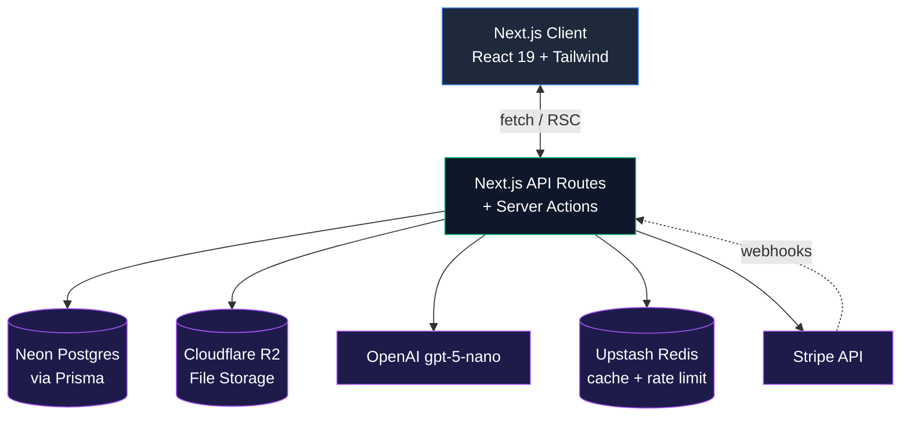
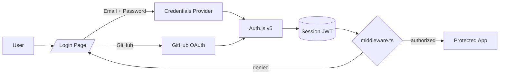
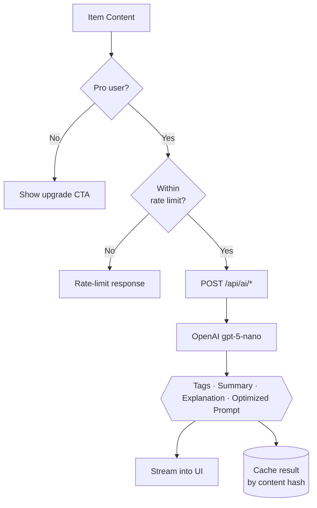

# 🗂️ DevStash — Project Specifications

> **Store Smarter. Build Faster.**
> A centralized, AI-enhanced developer knowledge hub for code snippets, prompts, docs, commands, and more.

---

## 📑 Table of Contents

1. [Problem](#-problem)
2. [Target Users](#-target-users)
3. [Core Features](#-core-features)
4. [Data Model](#-data-model)
5. [Tech Stack](#-tech-stack)
6. [Architecture](#-architecture)
7. [API Surface](#-api-surface)
8. [Folder Structure](#-folder-structure)
9. [Environment Variables](#-environment-variables)
10. [Auth Flow](#-auth-flow)
11. [AI Features](#-ai-features)
12. [Monetization](#-monetization)
13. [UI / UX](#-ui--ux)
14. [Development Workflow](#-development-workflow)
15. [Roadmap](#-roadmap)

---

## 🎯 Problem

Developers keep their essentials scattered across too many places:

| Where it lives now | What gets lost |
|---|---|
| VS Code + Notion | Snippets |
| Random chat threads | AI prompts |
| Project folders | Context files |
| Browser bookmarks | Useful links |
| Disk folders | Docs |
| `.txt` files | Commands |
| GitHub Gists | Project templates |
| Bash history | Terminal commands |

The result: **context switching, lost knowledge, inconsistent workflows.**

➡️ **DevStash provides ONE searchable, AI-enhanced hub for all dev knowledge.**

---

## 👤 Target Users

| Persona | Core Needs |
|---|---|
| 🧑‍💻 **Everyday Developer** | Quick access to snippets, commands, links |
| 🤖 **AI-First Developer** | Store prompts, workflows, contexts |
| 🎓 **Content Creator / Educator** | Save course notes, reusable code |
| 🏗️ **Full-Stack Builder** | Patterns, boilerplates, API references |

---

## ✨ Core Features

### A) Items & System Item Types

Every Item belongs to one type. Built-in (system) types:

| Icon | Type | Use Case |
|---|---|---|
| `</>` | **Snippet** | Reusable code blocks with syntax highlighting |
| 💬 | **Prompt** | LLM prompts and chains |
| 📝 | **Note** | Markdown notes & docs |
| ⌨️ | **Command** | Terminal / CLI commands |
| 📎 | **File** | Uploaded files (Pro) |
| 🖼️ | **Image** | Screenshots, diagrams |
| 🔗 | **URL** | Bookmarks & references |

> **Pro users** can define **Custom Types** (e.g. "Regex," "SQL Query," "Postman Request").

### B) Collections

Organize items — **mixed types allowed** within a collection.

Examples: `React Patterns` · `Context Files` · `Python Snippets` · `Onboarding Docs`

### C) Search

Full-text search across **content, tags, titles, types, language**.

### D) Authentication

- 📧 Email + Password (credentials)
- 🐙 GitHub OAuth

### E) Quality-of-Life Features

- ⭐ Favorites & 📌 pinned items
- 🕒 Recently used
- 📥 Import from files
- ✏️ Markdown editor for text items
- 📤 File uploads (images, docs, templates)
- 💾 Export (JSON / ZIP)
- 🌙 Dark mode (default)
- ⌘ Command palette (Raycast-style)
- ⌨️ Keyboard-first navigation

### F) AI Superpowers (Pro)

- 🏷️ **Auto-tagging** — generate tags from content
- 📋 **AI summaries** — TL;DR for long items
- 🧠 **Explain Code** — natural language walkthrough
- 🎯 **Prompt optimization** — refine LLM prompts

> AI powered by **OpenAI `gpt-5-nano`** (cheap, fast, sufficient for short-form tasks).

---

## 🗄️ Data Model

> **Prisma schema** — a working starting point with proper indexes, cascade rules, and unique constraints. Expect this to evolve as features land.

```prisma
// schema.prisma

generator client {
  provider = "prisma-client-js"
}

datasource db {
  provider = "postgresql"
  url      = env("DATABASE_URL")
}

// ─── USERS ─────────────────────────────────────────────────────

model User {
  id                   String   @id @default(cuid())
  email                String   @unique
  password             String?  // null for OAuth-only users
  name                 String?
  image                String?

  // Billing
  isPro                Boolean  @default(false)
  stripeCustomerId     String?  @unique
  stripeSubscriptionId String?  @unique
  planRenewsAt         DateTime?

  // Relations
  items                Item[]
  itemTypes            ItemType[]
  collections          Collection[]
  tags                 Tag[]
  accounts             Account[]   // NextAuth OAuth accounts
  sessions             Session[]   // NextAuth sessions

  createdAt            DateTime @default(now())
  updatedAt            DateTime @updatedAt
}

// ─── ITEMS ─────────────────────────────────────────────────────

model Item {
  id          String   @id @default(cuid())
  title       String
  description String?

  // Content
  contentType String   // "text" | "file"
  content     String?  @db.Text       // for text-based items
  language    String?                 // for snippets: "ts", "py", etc.

  // File metadata (Cloudflare R2)
  fileUrl     String?
  fileName    String?
  fileSize    Int?
  mimeType    String?

  url         String?  // for URL-type items

  // Flags
  isFavorite  Boolean  @default(false)
  isPinned    Boolean  @default(false)

  // Relations
  userId      String
  user        User     @relation(fields: [userId], references: [id], onDelete: Cascade)

  typeId      String
  type        ItemType @relation(fields: [typeId], references: [id])

  collectionId String?
  collection   Collection? @relation(fields: [collectionId], references: [id], onDelete: SetNull)

  tags        ItemTag[]

  createdAt   DateTime @default(now())
  updatedAt   DateTime @updatedAt
  lastUsedAt  DateTime?

  @@index([userId])
  @@index([userId, typeId])
  @@index([userId, collectionId])
  @@index([userId, isFavorite])
  @@index([userId, lastUsedAt])
}

// ─── ITEM TYPES ────────────────────────────────────────────────

model ItemType {
  id       String   @id @default(cuid())
  name     String
  slug     String   // "snippet", "prompt", etc.
  icon     String?
  color    String?
  isSystem Boolean  @default(false)

  userId   String?  // null = system type, set = user-defined (Pro)
  user     User?    @relation(fields: [userId], references: [id], onDelete: Cascade)

  items    Item[]

  @@unique([userId, slug])
  @@index([userId])
}

// ─── COLLECTIONS ───────────────────────────────────────────────

model Collection {
  id          String   @id @default(cuid())
  name        String
  description String?
  icon        String?
  isFavorite  Boolean  @default(false)

  userId      String
  user        User     @relation(fields: [userId], references: [id], onDelete: Cascade)

  items       Item[]

  createdAt   DateTime @default(now())
  updatedAt   DateTime @updatedAt

  @@index([userId])
}

// ─── TAGS ──────────────────────────────────────────────────────

model Tag {
  id     String @id @default(cuid())
  name   String
  color  String?

  userId String
  user   User   @relation(fields: [userId], references: [id], onDelete: Cascade)

  items  ItemTag[]

  @@unique([userId, name])  // tag names unique per user
  @@index([userId])
}

model ItemTag {
  itemId String
  tagId  String

  item Item @relation(fields: [itemId], references: [id], onDelete: Cascade)
  tag  Tag  @relation(fields: [tagId], references: [id], onDelete: Cascade)

  @@id([itemId, tagId])
  @@index([tagId])
}

// ─── NEXTAUTH ──────────────────────────────────────────────────
// Standard NextAuth Account / Session models go here.
// See: https://authjs.dev/getting-started/adapters/prisma
```

**Notes on the schema:**

- `onDelete: Cascade` ensures deleting a user wipes their data cleanly.
- `@@index` on `userId` combos — every query is scoped per-user, so these matter for performance.
- `@@unique([userId, name])` on Tag prevents duplicate tag names within an account.
- `lastUsedAt` enables the "Recently used" feature without scanning every row.

---

## 🧱 Tech Stack

| Category | Choice | Why |
|---|---|---|
| Framework | [Next.js 16](https://nextjs.org/) (App Router, React 19) | Full-stack, RSC, fast iteration |
| Language | [TypeScript](https://www.typescriptlang.org/) | Type safety end-to-end |
| Database | [Neon Postgres](https://neon.tech/) + [Prisma ORM](https://www.prisma.io/) | Serverless Postgres + great DX |
| Caching | [Redis](https://redis.io/) (Upstash, optional) | Search + rate limiting |
| File Storage | [Cloudflare R2](https://developers.cloudflare.com/r2/) | S3-compatible, no egress fees |
| Styling | [Tailwind CSS v4](https://tailwindcss.com/) + [shadcn/ui](https://ui.shadcn.com/) | Fast, accessible primitives |
| Auth | [Auth.js v5](https://authjs.dev/) (NextAuth) | Email + GitHub |
| Payments | [Stripe](https://stripe.com/docs) | Subscriptions + webhooks |
| AI | [OpenAI](https://platform.openai.com/docs) `gpt-5-nano` | Cheap, fast |
| Deployment | [Vercel](https://vercel.com/) | First-class Next.js host |
| Monitoring | [Sentry](https://sentry.io/) | Runtime errors (later) |
| Email | [Resend](https://resend.com/) | Transactional (verification, receipts) |

---

## 🏛️ Architecture



---

## 🔌 API Surface

Suggested route shape (App Router under `app/api`):

| Method | Route | Purpose |
|---|---|---|
| `GET` | `/api/items` | List items (filter by type, collection, tag, q) |
| `POST` | `/api/items` | Create item |
| `GET` | `/api/items/[id]` | Get item |
| `PATCH` | `/api/items/[id]` | Update item |
| `DELETE` | `/api/items/[id]` | Delete item |
| `POST` | `/api/items/[id]/favorite` | Toggle favorite |
| `GET` | `/api/collections` | List collections |
| `POST` | `/api/collections` | Create collection |
| `GET` | `/api/tags` | List tags |
| `GET` | `/api/search?q=...` | Full-text search |
| `POST` | `/api/upload` | Presigned R2 upload URL |
| `POST` | `/api/ai/tag` | Generate tags |
| `POST` | `/api/ai/summarize` | Summarize content |
| `POST` | `/api/ai/explain` | Explain code |
| `POST` | `/api/ai/optimize-prompt` | Improve a prompt |
| `POST` | `/api/billing/checkout` | Create Stripe session |
| `POST` | `/api/billing/portal` | Customer portal session |
| `POST` | `/api/webhooks/stripe` | Stripe webhook handler |

> Mutations can also be implemented as **Server Actions** where it makes sense — keep `/api/*` for cross-cutting concerns (webhooks, uploads, AI streaming).

---

## 📁 Folder Structure

```
devstash/
├── app/
│   ├── (auth)/
│   │   ├── login/
│   │   └── register/
│   ├── (dashboard)/
│   │   ├── items/
│   │   ├── collections/
│   │   ├── tags/
│   │   └── settings/
│   ├── api/
│   │   ├── items/
│   │   ├── ai/
│   │   ├── upload/
│   │   └── webhooks/
│   └── layout.tsx
├── components/
│   ├── ui/              # shadcn primitives
│   ├── items/
│   ├── editor/
│   └── command-palette/
├── lib/
│   ├── auth.ts
│   ├── prisma.ts
│   ├── stripe.ts
│   ├── r2.ts
│   ├── openai.ts
│   └── plan-limits.ts
├── prisma/
│   ├── schema.prisma
│   └── seed.ts
├── public/
└── middleware.ts        # auth + rate limiting
```

---

## 🔐 Environment Variables

```bash
# Database
DATABASE_URL="postgresql://..."

# Auth
NEXTAUTH_URL="http://localhost:3000"
NEXTAUTH_SECRET="..."           # `openssl rand -base64 32`
GITHUB_CLIENT_ID="..."
GITHUB_CLIENT_SECRET="..."

# Storage (Cloudflare R2)
R2_ACCOUNT_ID="..."
R2_ACCESS_KEY_ID="..."
R2_SECRET_ACCESS_KEY="..."
R2_BUCKET="devstash"
R2_PUBLIC_URL="https://..."

# AI
OPENAI_API_KEY="sk-..."

# Stripe
STRIPE_SECRET_KEY="sk_..."
STRIPE_WEBHOOK_SECRET="whsec_..."
STRIPE_PRICE_PRO_MONTHLY="price_..."
STRIPE_PRICE_PRO_YEARLY="price_..."

# Cache (optional)
UPSTASH_REDIS_REST_URL="..."
UPSTASH_REDIS_REST_TOKEN="..."

# Email
RESEND_API_KEY="re_..."
```

---

## 🔐 Auth Flow



---

## 🧠 AI Features



**Cost guardrails:**

- Cache responses by content hash to avoid re-billing the same input.
- Daily/monthly AI call caps per user (even Pro) to prevent runaway costs.
- Stream responses so users get TTFB feedback.

---

## 💰 Monetization

### Plans

| Plan | Price | Limits | Features |
|---|---|---|---|
| **Free** | $0 | 50 items · 3 collections | Snippets, prompts, notes, URLs · Basic search · Image uploads · Dark mode |
| **Pro** | **$8/mo** or **$72/yr** *(save ~25%)* | Unlimited | Everything in Free **+** File uploads · Custom item types · AI features · Export · Priority support |

### Feature Matrix

| Feature | Free | Pro |
|---|:---:|:---:|
| Snippets / Prompts / Notes / URLs | ✅ | ✅ |
| Collections | 3 max | Unlimited |
| Items | 50 max | Unlimited |
| Image uploads | ✅ | ✅ |
| File uploads (PDFs, zips, etc.) | ❌ | ✅ |
| Custom item types | ❌ | ✅ |
| AI auto-tagging | ❌ | ✅ |
| AI summaries | ❌ | ✅ |
| Explain Code | ❌ | ✅ |
| Prompt optimization | ❌ | ✅ |
| Export (JSON / ZIP) | ❌ | ✅ |
| Command palette | ✅ | ✅ |
| Dark mode | ✅ | ✅ |

> Billing handled by **Stripe Checkout** + Customer Portal. Webhook syncs `isPro`, `stripeSubscriptionId`, and `planRenewsAt` on `customer.subscription.*` events.

---

## 🎨 UI / UX

> **Reference screenshots:** Use the dashboard mockups below as a base for the
> dashboard UI. It does not have to be exact — treat them as references.
>
> - `context/screenshots/dashboard-ui-main.png` — main dashboard (sidebar, collections grid, pinned items)
> - `context/screenshots/dashboard-ui-drawer.png` — item detail drawer (content, tags, metadata)

**Design principles:**

- 🌙 **Dark mode first**, light as an option
- 🧘 **Minimal, developer-friendly** — no decorative chrome
- 🖍️ **Syntax highlighting** via [Shiki](https://shiki.style/)
- ⚡ **Keyboard-first** — every action has a shortcut
- 🎯 **Inspired by:** [Notion](https://notion.so), [Linear](https://linear.app), [Raycast](https://raycast.com)

**Layout:**

- **Collapsible left sidebar** — filters, collections, tags
- **Main workspace** — grid or list (user toggle)
- **Full-screen editor** for item detail view
- **⌘K command palette** for global navigation & quick-create

**Responsive:**

- Mobile drawer for sidebar
- Touch-optimized targets (44px min)
- Single-column item view on small screens

---

## 🛠️ Development Workflow

**Branching:**

```bash
git switch -c lesson-01-setup
git switch -c lesson-02-auth
git switch -c lesson-03-items-crud
```

One branch per lesson means students can `git checkout lesson-N` to follow along or diff against their own work.

**Tools to lean on:**

- [Cursor](https://cursor.com/) / [Claude Code](https://www.anthropic.com/claude-code) / [ChatGPT](https://chat.openai.com/) for pair-programming
- [Sentry](https://sentry.io/) for runtime monitoring (Pro Phase)
- GitHub Actions for CI (optional)

**Pre-commit:**

- ESLint + Prettier
- TypeScript strict mode
- Prisma migration check

---

## 🧭 Roadmap

### 🟢 MVP

- [ ] Auth (email + GitHub)
- [ ] Items CRUD (snippet, note, prompt, URL, command, image)
- [ ] Collections
- [ ] Tags
- [ ] Full-text search
- [ ] Free tier limits enforced
- [ ] Dark mode
- [ ] Command palette

### 🟡 Pro Phase

- [ ] Stripe checkout + customer portal
- [ ] Webhook sync
- [ ] File uploads (R2)
- [ ] Custom item types
- [ ] AI: auto-tag, summarize, explain code, optimize prompt
- [ ] Export (JSON / ZIP)

### 🔵 Future

- [ ] Shared collections (read-only links)
- [ ] Team / Org plans
- [ ] [VS Code extension](https://code.visualstudio.com/api)
- [ ] Browser extension (Chrome/Firefox)
- [ ] Public API + CLI tool
- [ ] Mobile app (Expo / RN)

---

## 📌 Status

🟡 **Planning** — ready for environment setup & UI scaffolding.

---

🏗️ **DevStash — Store Smarter. Build Faster.**
